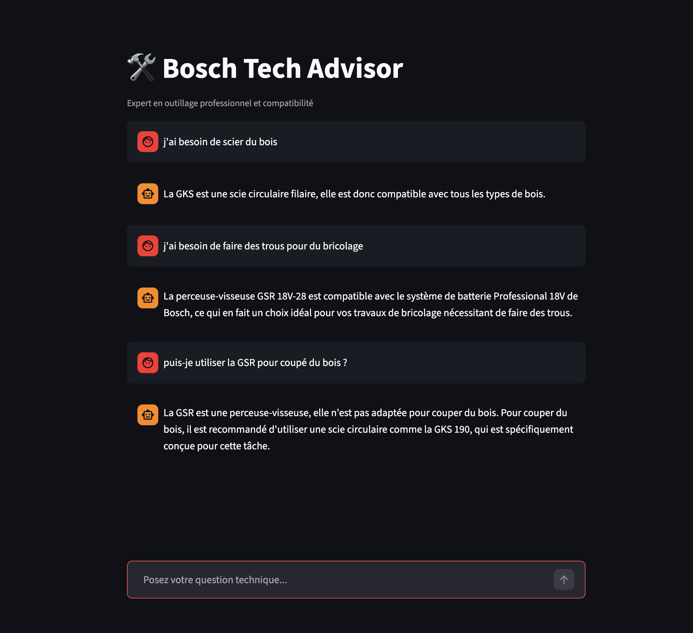
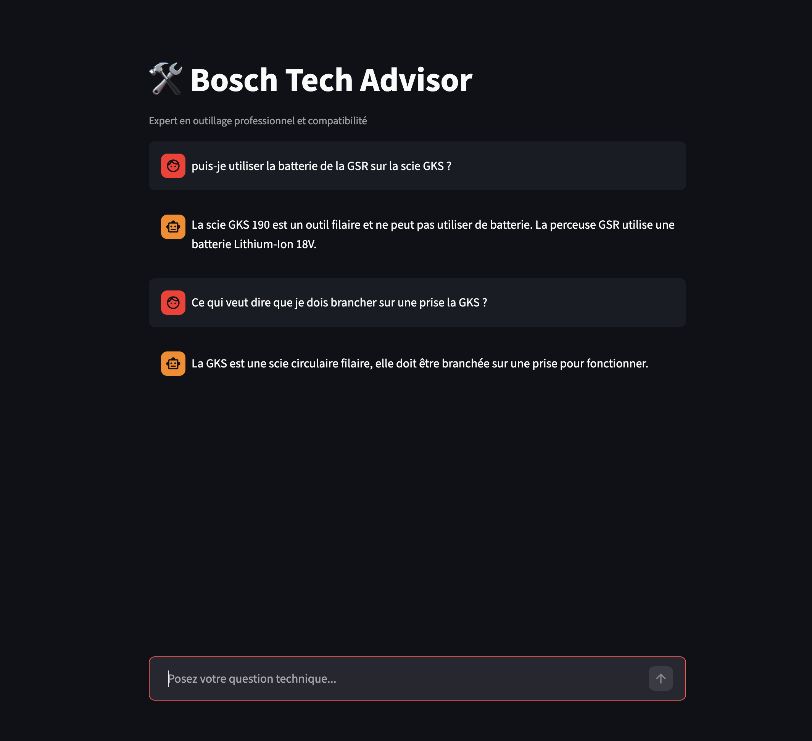

# 🛠️ Bosch Tech Advisor

### **AI-Powered Technical Support for Bosch Professional Tools**

Bosch Tech Advisor is an agentic RAG (Retrieval-Augmented Generation) system designed to help professionals verify tool specifications, battery compatibility, and technical documentation using **Mistral AI** and **LangGraph**.

---

## 🚀 Overview

Navigating technical manuals for professional tools can be time-consuming. This assistant uses a state-of-the-art AI agent to:

* **Search Documentation:** Queries a vector database of Bosch PDF manuals.
* **Validate Compatibility:** Automatically checks if batteries (e.g., 18V Professional) are compatible between different tool categories (GSR, GWS, GBH).
* **Structured Output:** Delivers data in a strict JSON format for consistency and technical accuracy.

## 🧠 Tech Stack

* **LLM:** [Mistral AI](https://mistral.ai/) (`mistral-small-latest`)
* **Orchestration:** [LangGraph](https://langchain-ai.github.io/langgraph/) (Cyclic graph for tool-calling loops)
* **Framework:** [LangChain](https://www.langchain.com/)
* **Vector Store:** [ChromaDB](https://www.trychroma.com/)
* **Interface:** [Streamlit](https://streamlit.io/)
* **Data Processing:** PyMuPDF for PDF extraction

## 🏗️ Architecture

The bot follows a **ReAct** (Reasoning + Acting) pattern:

1. **Agent Node:** Decides if the user's question requires technical documentation.
2. **Tool Node:** Executes a similarity search in the vector store.
3. **Validation:** The agent processes the search results and formats them into a structured `TechnicalValidation` schema.

## ⚙️ Installation

1. **Clone the repository:**
```bash
git clone https://github.com/your-username/bosch-tech-bot.git
cd bosch-tech-bot

```


2. **Install dependencies:**
```bash
pip install -r requirements.txt

```


3. **Set up environment variables:**
Create a `.env` file in the root directory:
```env
MISTRAL_API_KEY=your_api_key_here

```


4. **Add your data:**
Place your Bosch PDF manuals in the `/data` folder.
5. **Run the App:**
```bash
streamlit run app.py

```


## 📊 Example Usage

**User:** *"Est-ce que ma batterie de perceuse GSR 18V-55 est compatible avec la meuleuse GWS 18V-10 ?"*

**Assistant:** > ✅ **Compatible**

> **Reasoning:** Les deux outils font partie de la gamme Bosch Professional 18V System. Les batteries sont interchangeables entre tous les outils de cette catégorie de tension.

---

**Would you like me to help you write a "Lessons Learned" section about the LangGraph message sequencing issues we just fixed?**


